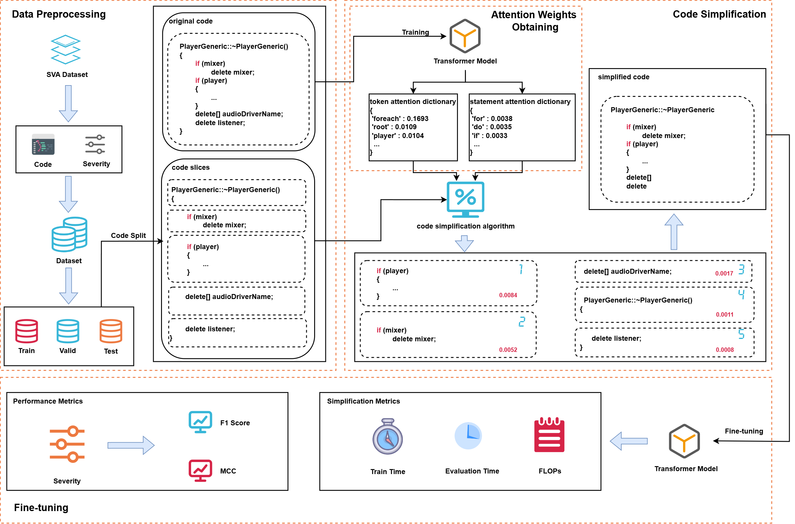

# Accelerating Software Vulnerability Assessment Model Construction through Code Simplification

## Introductin
CS-SVA (Code Simplification for Software Vulnerability Assessment) is a novel framework designed to improve the efficiency of vulnerability detection models by simplifying input code while preserving key vulnerability-related features. This approach employs a dual-granularity pruning strategy, integrating statement-level and token-level simplifications, significantly reducing computational costs without substantial performance degradation.

By leveraging pre-trained language models (PLMs), such as CodeT5, CS-SVA achieves a balance between model accuracy and inference efficiency, making it suitable for large-scale vulnerability assessment tasks.


## Approach



## Dataset
We utilize the **MegaVul** dataset for vulnerability assessment. You can access the original dataset from its official repository on GitHub: [MegaVul](https://github.com/Icyrockton/MegaVul).  

For convenience, the processed version of the dataset used in our experiments is available for download from **Google Drive**: [Download Here](https://docs.google.com/spreadsheets/d/1Ovd8CkY89f2u-6P-2wGKF-xMYptS3kBO/edit?usp=sharing&ouid=111461340104776755635&rtpof=true&sd=true).


## Requriments
To set up the required dependencies for this project, install the necessary packages by running the following command:  

```bash
pip install -r requirements.txt
```


## Attention weights obtaining 
To analyze the attention distribution of the model, run the `analyse_attn.py` script:  
```bash
python analyse_attn.py
```


## Data preprocessing
To prepare the dataset for training and evaluation, follow these steps:  
First, execute the `split_dataset.py` script to divide the raw dataset into training, validation, and test sets:  
```bash
python split_dataset.py
```
After splitting the dataset, run the `data_processing.py` script to apply necessary preprocessing steps:
```bash
python data_processing.py
```


## Experimental results reproducing
To reproduce the experimental results for **RQ1-RQ4**, follow the steps below. Each step corresponds to the reproduction of a specific research question's results.  

**RQ1: How does our proposed CS-SVA method perform compared to the state-of-the-art SVA baseline methods and models?**  
To evaluate the performance of CS-SVA compared to state-of-the-art SVA baselines, follow these steps:  

1. Navigate to the `baseline/function_level_Le/` directory:  
   ```bash
   cd baseline/function_level_Le
   ```
   Follow the instructions in `readme.md` to execute the required scripts and generate the Fuc variant baseline results.
2. Run the `CWM.py` script to generate results for the CWM variant baseline:
   ```bash
   python CWM.py
   ```
3. Navigate to the `baseline/model/` directory, and Run `run_model.py` to evaluate the baseline models:
   ```bash
   cd baseline/model
   python run_model.py
   ```
**RQ2: How different pruning granularites impact the performance of CS-SVA?**  
To analyze the impact of different pruning granularities on CS-SVA's performance, we conduct experiments using three pruning strategies:  
- **slim** (CS-SVA’s original pruning method)  
- **token** (token-level pruning)  
- **statement** (statement-level pruning)  
To reproduce the results, update the `prune_strategy` parameter in the following commands and execute them separately for each strategy.
**Training**
```bash
python run_classifier.py \
    --model_type codet5 \
    --task_name vulnerability \
    --do_train \
    --do_eval \
    --evaluate_during_training \
    --eval_all_checkpoints \
    --output_attention \
    --train_file train_processed.txt \
    --dev_file val_processed.txt \
    --max_seq_length 256 \
    --per_gpu_train_batch_size 8 \
    --per_gpu_eval_batch_size 8 \
    --learning_rate 5e-5 \
    --weight_decay 0.01 \
    --adam_epsilon 1e-8 \
    --warmup_steps 500 \
    --num_train_epochs 20 \
    --early_stopping_patience 2 \
    --lang cpp \
    --gradient_accumulation_steps 4 \
    --overwrite_output_dir \
    --prune_strategy $(prune_strategy) \
    --data_dir ../dataset/processed_data \
    --output_dir ./codet5/$(prune_strategy) \
    --tokenizer_name ./codet5 \
    --model_name_or_path ./codet5
```
**Evaluating**
```bash
python run_classifier.py \
    --model_type codet5 \
    --task_name vulnerability \
    --do_predict \
    --output_attention \
    --test_file test_processed.txt \
    --max_seq_length 256 \
    --per_gpu_train_batch_size 8 \
    --per_gpu_eval_batch_size 8 \
    --learning_rate 5e-5 \
    --lang cpp \
    --gradient_accumulation_steps 4 \
    --overwrite_output_dir \
    --prune_strategy $(prune_strategy) \
    --data_dir ../dataset/processed_data \
    --output_dir ./codet5/$(prune_strategy) \
    --pred_model_dir ./codet5/$(prune_strategy)/checkpoint-best/pytorch_model.bin \
    --tokenizer_name ./codet5 \
    --model_name_or_path ./codet5 \
    --test_result_dir ./codet5/result/$(prune_strategy).txt
```

**RQ3: How different PLMs influence the performance of CS-SVA?**  
To evaluate the impact of different pre-trained language models (PLMs) on CS-SVA's performance, we modify `model_type` in the training and testing commands used for RQ2.
We experiment with multiple PLMs, such as:
- **codet5** (CodeT5)
- **codebert** (CodeBERT)

**RQ4: How different simplification ratios influence the performance of CS-SVA?**
To evaluate the impact of different simplification ratios on CS-SVA’s performance, we modify the `prune_strategy` parameter. Specifically, we experiment with:  
- **random** (Random pruning of code segments)  
- **frequency** (Frequency-based pruning strategy)  
  


